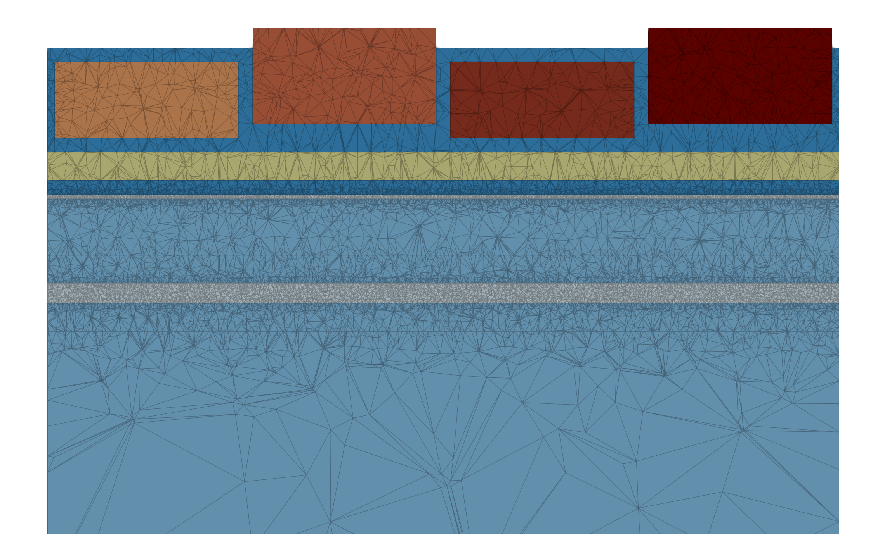
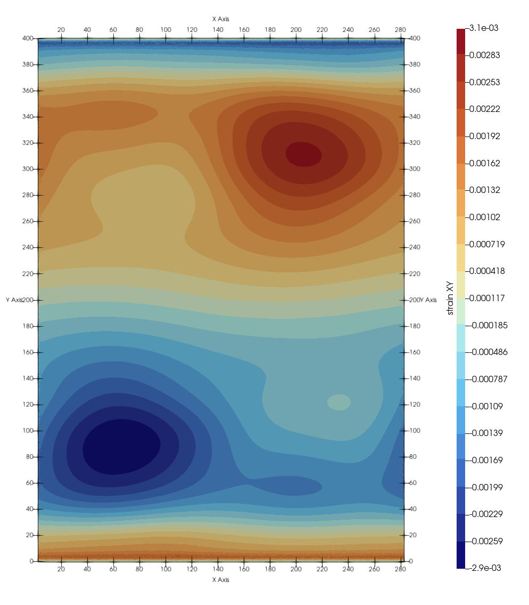
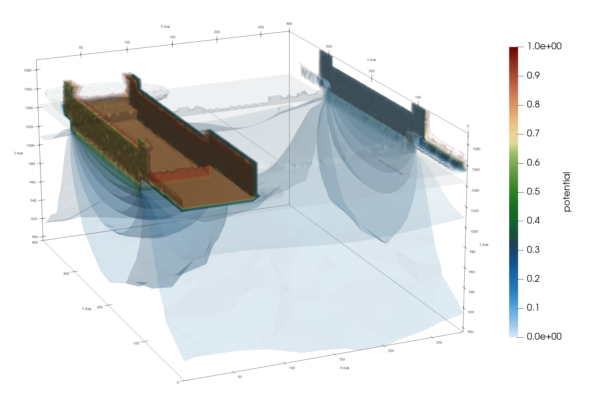

# StrainedElectronicDevices.jl

A Julia package for simulating strained electronic devices with coupled electrostatic and elastic effects.

## Overview

StrainedElectronicDevices.jl enables modeling and simulation of semiconductor devices where strain engineering plays a critical role in device performance. The package provides tools to:

- Define complex 3D device geometries with multiple material layers
- Compute elastic deformations under applied pre-stress and thermal effects
- Solve electrostatic problems in the presence of strain
- Handle coupled elasticity and electrostatics problems in single, unified simulations

## Showcase Example: QuantumBus Device

The example includes a comprehensive simulation of a QuantumBus device: a silicon-based quantum computing platform with integrated electrostatic gates.

<p float="left">
  
  
  
</p>

For more details on the theoretical background and applications, refer to the associated poster:

View on Zenodo: https://zenodo.org/records/18877071


### Key Features of the QuantumBus Example

The `scripts/QuantumBus.jl` script showcases:

**Device Geometry:**
- A multi-layered silicon structure with quantum well regions
- SiGe barrier layers for strain engineering
- SiO₂ insulation layers
- Titanium Nitride (TiN) gate electrodes in both planar (side) and keyboard arrangements

**Physics Simulation:**

1. **Electrostatic Analysis**
   - Solves Poisson's equation to compute electric potential distributions
   - Models applied gate voltages for quantum dot confinement
   - Accounts for spatial permittivity variations across different materials

2. **Elasticity Analysis**
   - Computes 3D displacement and strain fields
   - Incorporates pre-stress from TiN gate materials
   - Accounts for thermal strain and lattice mismatch effects
   - Uses advanced finite element techniques with adaptive mesh refinement

**Material Properties:**
- Silicon (Si): Primary channel material
- SiGe alloys: Strain-engineering barriers
- Silicon dioxide (SiO₂): Dielectric insulation
- Titanium Nitride (TiN): Gate conductor with controlled pre-stress

### Usage

You will need a Julia (1.0+) installation with the package `TestEnv` installed.

```julia
using TestEnv; TestEnv.activate() # this loads additional dependencies for the script

include("scripts/QuantumBus.jl")

# Run simulation with default parameters
sol_electrostatic, sol_elasticity, device = QuantumBus.simulate()

# Visualize results
QuantumBus.plot(sol_electrostatic, sol_elasticity, device)

# alternative: single call for simulation and plot
QuantumBus.main()

# Export VTK files for external visualization
# Output: QuantumBus_displacement.vtu (strain and displacement fields)
# Output: QuantumBus_electric_potential.vtu (electric potential distribution)
```

### Selected Options (for `main` / `simulate`)

- `solve_u`, `solve_phi`: `true / false`, toggle to solve for displacement/electrostatic field
- `grid_variant`: `:coarse / :fine`, variant of the pre-defined grid
- `σ_0`: in-plane pre-stress of the clavier gates in MPa
- `order_displacement`, `order_electric_potential`: FE order of the discrete solutions


# Dependencies

    ExtendableFEM.jl - Finite element framework
    ExtendableGrids.jl - Grid data structures
    StaticArrays.jl - Efficient tensor computations
    LinearAlgebra.jl - Linear algebra operations

# License

MIT License

# Citation

If you use this package in your research, please cite the associated work:
BibTeX

```
@misc{qubus_poster,
  title={StrainedElectronicDevices.jl: Coupled Electrostatic and Elastic Simulations},
  url={https://zenodo.org/records/18877071},
  note={Available at Zenodo}
}
```
#
